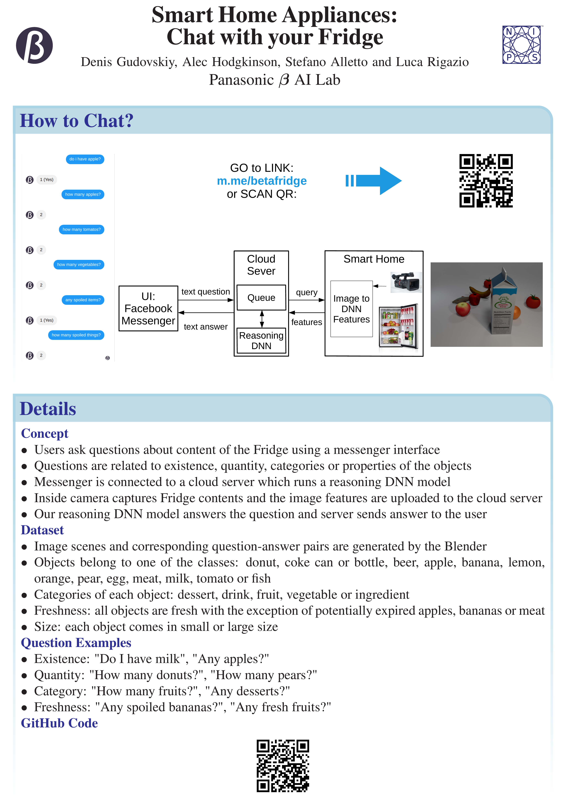

# Code for paper
**[Smart Home Appliances: Chat with Your Fridge](https://arxiv.org/pdf/1912.09589.pdf)**

Code consists of three components, each has its own repository:

[Facebook chatbot demo app repository](https://github.com/gudovskiy/fridge-demo/)

[FRIDGR dataset repository](https://github.com/gudovskiy/fridge-dataset/)

[Reasoning model repository](https://github.com/gudovskiy/fridge-network/)

## BibTeX citation
```bash
@article{chat-fridge,
	author = {Denis Gudovskiy and Gyuri Han and Takuya Yamaguchi and Sotaro Tsukizawa},
	journal = {arXiv preprint arXiv:1912.09589},
	title = {Smart Home Appliances: Chat with Your Fridge},
	year = {2019}
}
```

## NeurIPS 2019 Poster
<div align="center">
  
</div>
